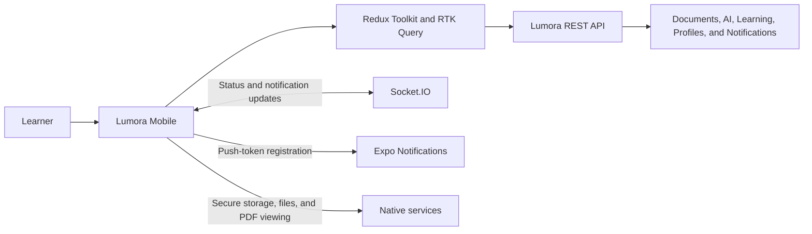

# Lumora Mobile
  A mobile-first, document-grounded AI learning companion built with React Native and Expo.

Lumora Mobile turns PDF study material into an active learning experience. Upload a document, follow its processing status, read it on your phone, ask AI questions grounded in its contents, generate summaries and concepts, review flashcards, take quizzes, and keep up with learning activity from one app.

> **Status:** Active development. Core learner flows are implemented; the most recent Android development-build testing verified authentication, session restore, logout, empty learning states, and push-notification delivery. See [Known limitations](#known-limitations) before production use.

## Features

- **Secure account access** — email/password registration and sign-in, Google OAuth, email verification, secure refresh-token storage, session restore, and logout.
- **Learning dashboard** — at-a-glance counts for documents, due flashcards, quizzes, quiz scores, and recent activity.
- **PDF document library** — import PDFs from device storage, validate type and size (up to 50 MB), track upload/processing state, filter documents, and open document details.
- **Protected PDF viewing** — authenticated download, temporary local caching, native viewing, retries, and an external-open fallback.
- **Document-grounded AI** — chat with a document, retain conversation history, and inspect page-level source citations.
- **AI study actions** — generate summaries, key takeaways, concepts, and focused concept explanations from a ready document.
- **Flashcard review** — review global or document-specific decks, reveal answers, set difficulty, filter due cards, and track review progress.
- **Quizzes** — generate quizzes by difficulty, answer questions, submit attempts, review scores, correct answers, and explanations, then retake quizzes.
- **Realtime updates** — Socket.IO refreshes for document status and notifications, with cache refreshes when the app resumes or a socket fails.
- **Native notifications** — Expo push-token registration and notification inbox controls, including unread filtering and mark-as-read actions.
- **Accessible, resilient UI** — touch-friendly controls, screen-reader labels, clear loading/empty/error states, and stale-data notices.

## Screenshots

| Dashboard | Documents | Flashcards |
| --- | --- | --- |
|  |  |  |

| Quizzes | Notifications | Profile |
| --- | --- | --- |
|  |  |  |

## Technology

| Area | Tools |
| --- | --- |
| Mobile framework | React Native 0.86, React 19, Expo 57 |
| Navigation | Expo Router with bottom tabs and document-scoped stack routes |
| Language | TypeScript |
| Client state and server cache | Redux Toolkit and RTK Query |
| Authentication storage | Expo SecureStore |
| Device services | Expo Document Picker, File System, Sharing, Notifications, Device, and Linking |
| PDF rendering | `@kishannareshpal/expo-pdf` with a cached-file workflow |
| Realtime | Socket.IO client |
| Builds | EAS Build |

## Architecture



The app is online-first. RTK Query keeps server data fresh, Socket.IO updates active sessions, and resume/socket-failure invalidations recover critical data after backgrounding. Refresh tokens are held in SecureStore while access tokens remain in memory.

## Getting started

### Prerequisites

- Node.js 20 or later (LTS recommended)
- npm
- An Android emulator/device, iOS simulator/device, or a browser for the web target
- A reachable Lumora backend exposing the mobile API routes described in [Backend integration](#backend-integration)

### Installation

```bash
git clone https://github.com/dinukaly/Lumora-Mobile.git
cd Lumora-Mobile
npm install
```

Create a local environment file named `.env.local` in the repository root:

```env
EXPO_PUBLIC_API_URL=https://your-api-host.example.com/api/v1
```

Then start the app:

```bash
npm start
```

Use the Expo terminal controls to open a target, or run one directly:

```bash
npm run android
npm run ios
npm run web
```

For native PDF rendering and push notifications, use an Expo development build rather than relying solely on Expo Go:

```bash
npx expo start --dev-client
```

### Android development build

The repository contains development, preview, and production EAS profiles in [`eas.json`](eas.json). After configuring your Expo/EAS account and Android credentials, build an installable Android development client with:

```bash
npx eas build --platform android --profile development
```

## Available commands

| Command | Description |
| --- | --- |
| `npm start` | Start the Expo development server. |
| `npm run android` | Run the Android app. |
| `npm run ios` | Run the iOS app. |
| `npm run web` | Start the web target. |
| `npm run lint` | Run Expo ESLint checks. |
| `npm run typecheck` | Run TypeScript without emitting output. |

Run the quality checks before opening a pull request:

```bash
npm run lint
npm run typecheck
```

## Configuration

| Variable | Required | Description |
| --- | --- | --- |
| `EXPO_PUBLIC_API_URL` | Yes | Full Lumora API base URL, including `/api/v1`. |

If `EXPO_PUBLIC_API_URL` is absent, the app falls back to `http://localhost:5000/api/v1`. This is useful only when the API is reachable as `localhost` from the running client. On a physical Android or iOS device, use your computer's LAN IP address or a publicly reachable HTTPS URL instead.

## Backend integration

Lumora Mobile is a client for the Lumora backend. The backend must be reachable from the device and support bearer authentication, mobile refresh tokens, and Socket.IO connections.

### Required mobile auth routes

```text
POST /api/v1/auth/mobile/register
POST /api/v1/auth/mobile/login
POST /api/v1/auth/mobile/refresh
POST /api/v1/auth/mobile/logout
```

### Core API capabilities

- Documents: upload PDFs, list/filter documents, retrieve detail, and download protected PDF bytes.
- AI: document chat, summaries, concepts, concept explanations, flashcard generation, and quiz generation.
- Learning: progress summaries, flashcard review, quizzes, and quiz submissions.
- Notifications: list, mark one read, or mark all read.
- Profile: retrieve the authenticated user and register/remove Expo push tokens.
- Realtime: authenticated Socket.IO events for document status and new notifications.

The app expects the API URL to end in `/api/v1`; it derives the Socket.IO origin from that base URL. The backend must allow requests and socket connections from mobile development and production clients while keeping browser CORS policies appropriately scoped.

## Project structure

```text
app/                         Expo Router screens and route layouts
  (auth)/                    Login and registration
  (tabs)/                    Dashboard, documents, flashcards, quizzes, profile
  document/[id]/             Document overview, PDF, chat, AI actions, study tools
  verify-email/              Email-verification flow
src/
  api/                       RTK Query API endpoints and data types
  auth/                      Session bootstrap, OAuth, verification, token storage
  components/                Reusable UI and feature components
  notifications/             Push-registration bridge
  realtime/                  Socket.IO connection and cache updates
  services/                  Upload, PDF-cache, chat-stream, and push helpers
  store/                     Redux store and hooks
  theme/                     Shared colors, typography, spacing, radii, shadows
assets/
  screenshots/               README product screenshots
```

## Known limitations

- The app is **online-first**; AI generation, chat, processing updates, and fresh learning data require network access.
- Chat streaming infrastructure exists but is intentionally disabled until it is validated on both Android and iOS. The implemented default is reliable non-streaming chat.
- Job-specific generation progress is limited because the backend does not yet expose a public job-status endpoint.
- Protected PDF behavior still needs full real-device validation on iOS.
- Android device testing has covered key auth and notification flows; the full cross-feature Android/iOS test matrix remains in progress.
- Mobile administration is deliberately out of scope. This app focuses on learner workflows.

Go this link to Download the APK file:

[Download APK](https://expo.dev/accounts/dinukaly/projects/lumora-mobile/builds/c8829058-bb5d-4737-8d8c-c56a1abe0542)

## License

This project is licensed under the MIT License.
